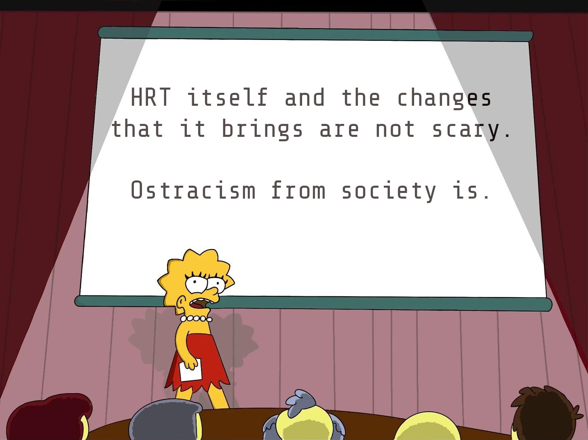
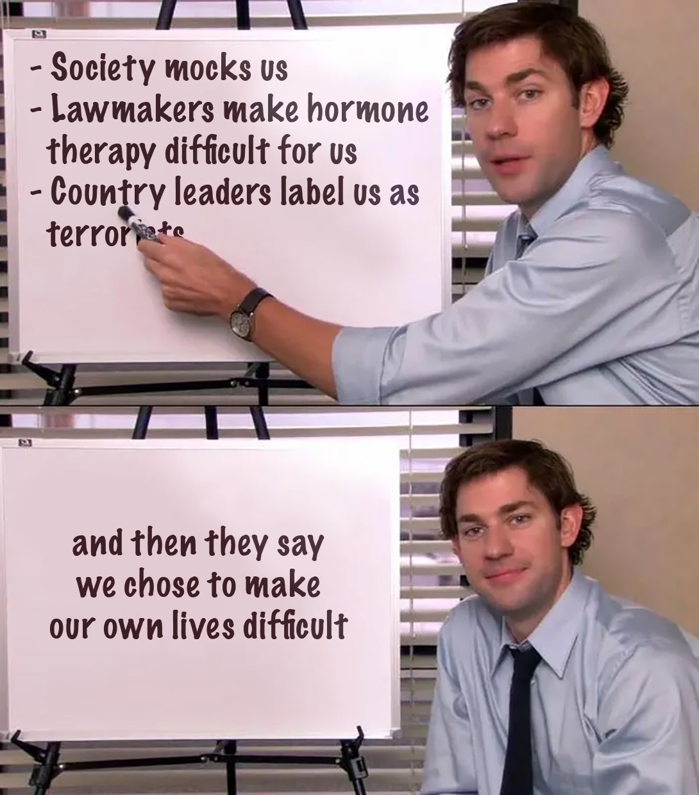
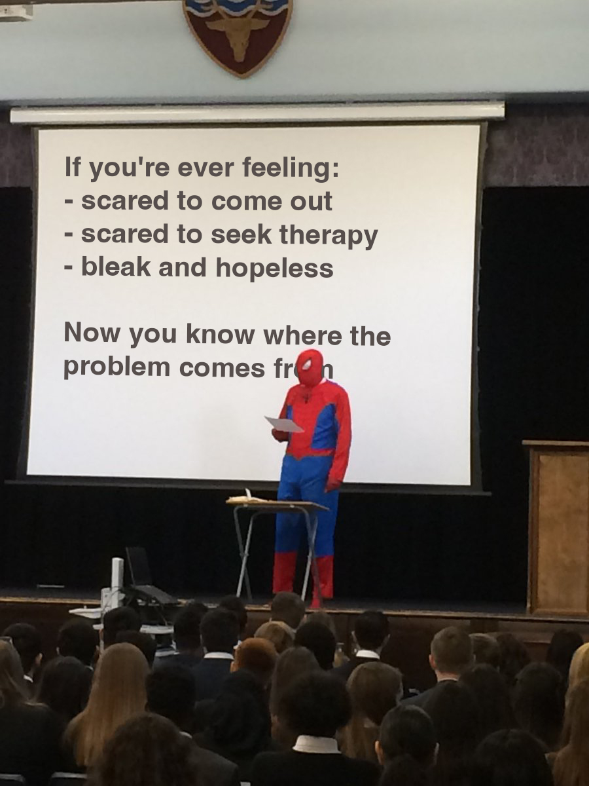

import { PreviewOnly, FullPageOnly } from '@site/src/components/composing'
import Link from '@docusaurus/Link'
import { useBlogPost } from '@docusaurus/plugin-content-blog/lib/client/contexts.js'

{/* Note: hashtag links break in list view */}
{/* https://github.com/facebook/docusaurus/issues/9731 */}
<PreviewOnly>
  I have came across quite <Link to={`${useBlogPost().metadata.permalink}#reddit-references`}>a few posts on Reddit</Link> where the posters expressed their worries that are either about starting HRT, the changes from HRT, coming out, or being found out.
</PreviewOnly>
<FullPageOnly>
  I have came across quite [a few posts on Reddit](#reddit-references) where the posters expressed their worries that are either about starting HRT, the changes from HRT, coming out, or being found out.
</FullPageOnly>

For quite some time, I have been wondering too, just _**why**_? I have also felt the same fear and anxiety in the beginning, and even every now and then, a small trace of that fear and anxiety still haunts me.

{/* truncate */}

## Internal Monologue

I still remember some of my internal monologue right before my first injection:
- "This is surreal, am I actually turning myself… into a girl?"
- "There is no going back…"
- "How am I going to explain the physical changes to my parents?"
- "I really wish I was born as the correct cis gender so I don't have to do all this…"
- "I've mustered the courage to source my vial and needles, I've come this far, am I having last-minute doubts?"
- "Relax, it's just a little poke…"

Do any of these lines sound familiar?

## Analyzing My Observations

After sitting alone and thinking for a while, I arrived at some conclusions that gave inspiration to the following memes:

:::info
Fonts used in memes:
- Share Tech Mono (free on [Google Fonts](https://fonts.google.com/specimen/Share+Tech+Mono))
- Marker Felt (Apple-only)
- Helvetica
:::

Of course, there are less serious (but valid) reasons such as fear of needles, fear of messing up DIY-ing, fear of body changes itself, etc. But still, I reckon that these fears are relatively easier to overcome compared to overcoming the fear and pressure from society. This is because there are solid steps that one can take to overcome these fears such as repetition, practicing sanitary behavior, and conducting enough self-research to make a well-informed decision.

## The Takeaway

You see, the point is, society has done much harm to us but very often we're not even aware of it and end up thinking that it's our problem. Of course, whether you're hesitating to transition or come out, I am not implying that you need to be in a hurry to make a decision. The content above are just some food for thought as you continue to explore different ideas and challenge yourself with different thoughts until you can arrive at a well-informed decision.

## Reddit References

{/* Sorted by date posted */}
- [It's so scary to trust someone with your healthcare when they cannot gender you correctly](https://www.reddit.com/r/trans/comments/1tomy57) {/* 2d ago */}
- [r/MtF: Nobody told me how scary physical changes can be](https://www.reddit.com/r/MtF/comments/1thz9n0/nobody_told_me_how_scary_physical_changes_can_be) {/* 5d ago */}
- [r/MtF: I'm scared of the future, but for the first time I want one](https://www.reddit.com/r/MtF/comments/1sl345u/im_scared_of_the_future_but_for_the_first_time_i) {/* 1mo ago */}
- [r/MtF: Terrified](https://www.reddit.com/r/MtF/comments/1s2bq2h/terrified) {/* 2mo ago */}
- [r/transfem: im scared about coming out to my family](https://www.reddit.com/r/transfem/comments/1pdsp0p/im_scared_about_coming_out_to_my_family) {/* 6mo ago */}
- [r/ftm: Why am I scared?](https://www.reddit.com/r/ftm/comments/1noa2jx/why_am_i_scared) {/* 8mo ago */}
- [r/transsex: I'm about to buy estrogen and needles, but can't shake off my fear of being caught](https://www.reddit.com/r/transsex/comments/1kwvsz7/im_about_to_buy_estrogen_and_needles_but_cant) {/* 1y ago */}
- [r/ftm: anybody else kind of scared?](https://www.reddit.com/r/ftm/comments/1iq2w7g/anybody_else_kind_of_scared) {/* 1y ago */}
- [r/ftm: scared](https://www.reddit.com/r/ftm/comments/1jghku5/scared) {/* 1y ago */}
- [r/transsex: want to DIY but still scared](https://www.reddit.com/r/transsex/comments/1kvnsrd/want_to_diy_but_still_scared) {/* 1y ago */}
- [r/TransDIY: im so scared](https://www.reddit.com/r/TransDIY/comments/1k62v93/im_so_scared) {/* 1y ago */}
